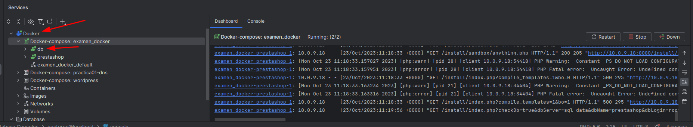
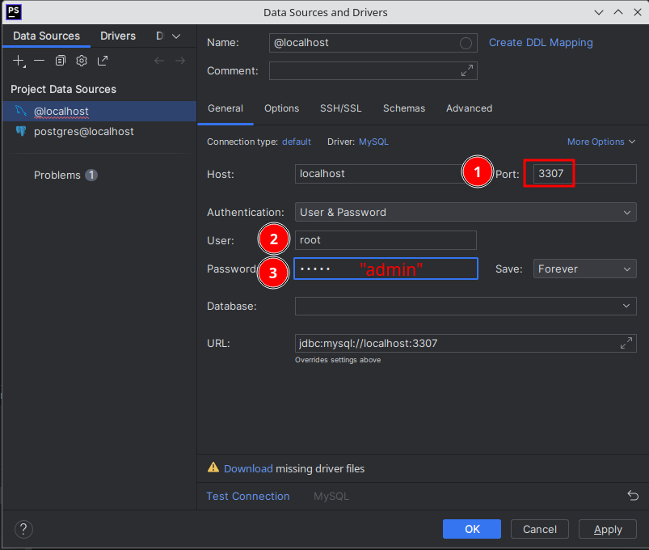
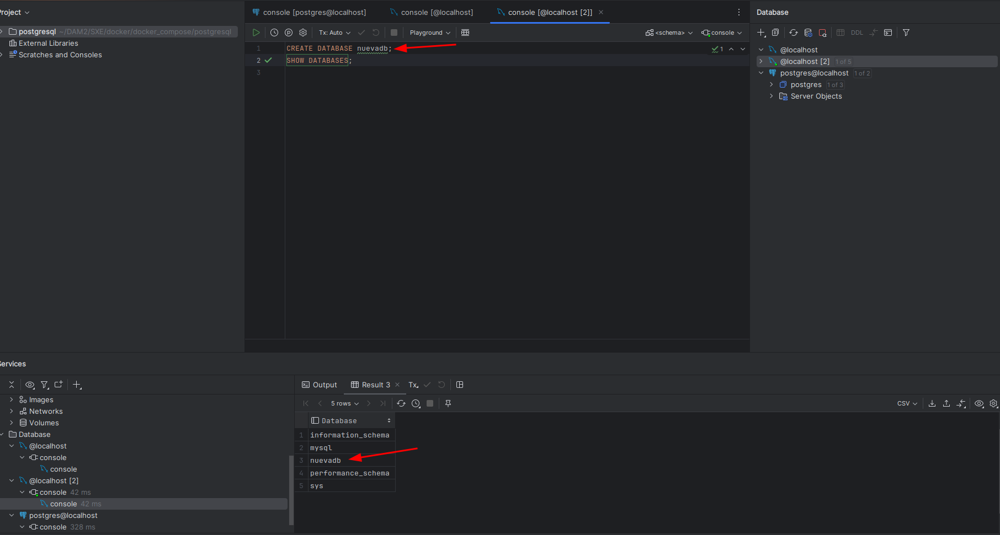
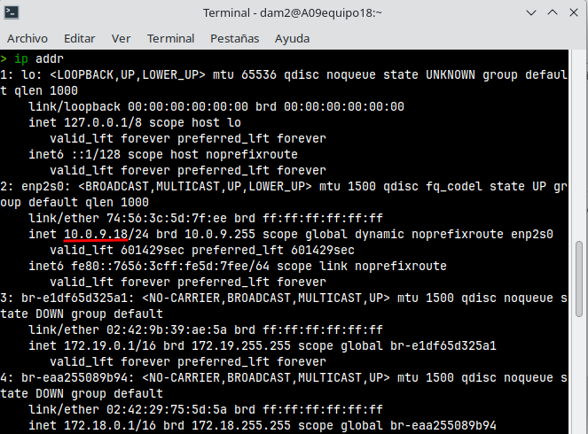
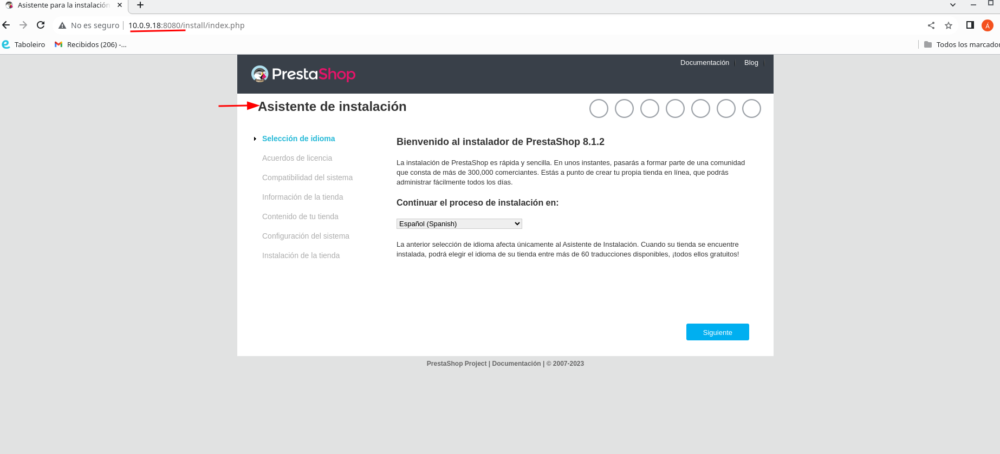

# EXAMEN 23/10/23

Utiliza docker para poner en marcha Prestashop según esta [imagen](https://hub.docker.com/r/prestashop/prestashop/).

Describe el proceso en un documento Readme. Utiliza capturas para demostrar el funcionamiento en el navegador.

Se valorará:

* El uso de docker-compose
* Base de datos enlazados al PhpStorm
* Claridad en la explicación

## Configuracion Docker Compose
Hacemos configuración del dichero _.yml_ y lo lanzamos con `docker compose up -d`.

Tenemos que estar dentro del directorio donde se encuentra el Compose.

Ambos contenedores se crearán con un red tipo `bridge` y esto hace que estén contectados entre sí mediante la misma interfaz de red.

> Algunos comentarios en el fichero ._yml_

## Comprobacion de la conexión

### SQL
#### A. Desde el host usando el puerto 3307:
```bash
$ docker ps   
CONTAINER ID   IMAGE                   COMMAND                  CREATED         STATUS         PORTS                                   NAMES
8840a9c35e6c   prestashop/prestashop   "docker-php-entrypoi…"   9 minutes ago   Up 9 minutes   0.0.0.0:8080->80/tcp, :::8080->80/tcp   examen_docker-prestashop-1
a90855b86e74   mysql:latest            "docker-entrypoint.s…"   9 minutes ago   Up 9 minutes   0/tcp, 3306/tcp, 33060/tcp              examen_docker-db-1
$ docker exec -it a90855b86e74 bash
```

Desde dentro del contenedor ejecutar `mysql -uroot -padmin -h localhost --port 3307`

Salida:
```bash
mysql: [Warning] Using a password on the command line interface can be insecure.
Welcome to the MySQL monitor.  Commands end with ; or \g.
Your MySQL connection id is 9
Server version: 8.1.0 MySQL Community Server - GPL

Copyright (c) 2000, 2023, Oracle and/or its affiliates.

Oracle is a registered trademark of Oracle Corporation and/or its
affiliates. Other names may be trademarks of their respective
owners.

Type 'help;' or '\h' for help. Type '\c' to clear the current input statement.

mysql> 
```

#### B. Desde PhpStorm
Hacemos conexion a una base de datos MySQL


Rellenamos las variables de entorno como las hemos rellenado en el Compose y descargamos los drivers:



Hacemos 2 consultas.


Comprobamos que se ha creado la tabla correctamente entrando a la db desde el terminal
```bash
MySQL [(none)]> SHOW DATABASES;
+--------------------+
| Database           |
+--------------------+
| information_schema |
| mysql              |
| nuevadb            |
| performance_schema |
| sys                |
+--------------------+
5 rows in set (0,003 sec)
```

### Prestashop


Buscar en el navegador DIRECCION_IP:PUERTO_HOST_PRESTASHOP


Instalamos Prestashop


Resultado:
